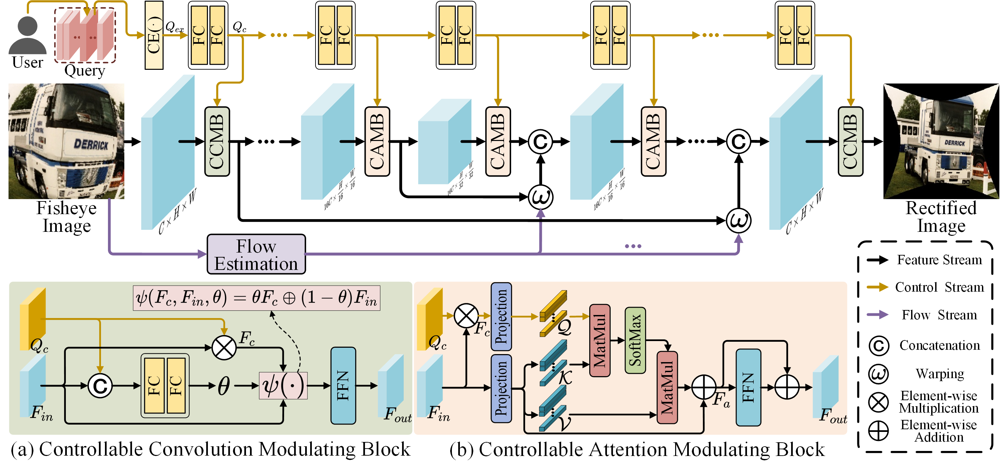

# [ECCV 2024] QueryCDR
This is the official PyTorch implementation of the paper [QueryCDR: Query-based Controllable Distortion Rectification Network for Fisheye Images](https://www.ecva.net/papers/eccv_2024/papers_ECCV/papers/02355.pdf).

## Contents
- [Overview](#overview)
- [Contribution](#contribution)
- [Requirements](#requirements)
- [Dataset](#dataset)
- [Test](#test)
- [Train](#train)
- [Citation](#citation)
- [Acknowledgement](#acknowledgement)

## Overview


## Contribution
* We propose QueryCDR, a Query-based Controllable Distortion Rectification network for fisheye images. Extensive experiments demonstrate that our QueryCDR can deliver superior results on a variety of distortion degrees.
* We propose the Distortion-aware Learnable Query Mechanism (DLQM), which effectively introduces the latent spatial relationships to control conditions for fisheye image rectification.
* We propose two kinds of blocks for modulating features using control conditions: the Controllable Convolution Modulating Block (CCMB) and the Controllable Attention Modulating Block (CAMB). They can effectively utilize control conditions to guide the rectification process.

## Requirements
- Linux
- Python 3.9.13
- Pytorch 1.13

```
einops==0.8.0
matplotlib==3.6.2
numpy==1.23.4
opencv_python==4.7.0.72
Pillow==10.4.0
scipy==1.9.1
tensorboardX==2.6.2.2
timm==0.9.7
torch==1.13.0+cu116
torchvision==0.14.0+cu116
tqdm==4.64.1
```

## Dataset
#### Pre-training Dataset

For pre-training the network,  you need to download the perspective dataset [Places2](http://places2.csail.mit.edu/download.html) or [Coco](https://cocodataset.org/). Then, move the downloaded images to

```
--data_prepare/pre_picture
```
run
```
python data_prepare/get_dataset_pre.py
# Specify whether the dataset is a train or test set by mode= 'train' or mode= 'test'
```
to generate your fisheye dataset. The generated fisheye images and new GT will be placed in 

```
--dataset_pre/data/train 
--dataset_pre/gt/train  
or 
--dataset_pre/data/test
--dataset_pre/gt/test
```

#### Fine-tuning Dataset

For fine-tuning the network with various distortion degrees, you need to move the images to

```
--data_prepare/fine_picture
```

run

```
python data_prepare/get_dataset_fine.py
# Specify whether the dataset is a train or test set by mode= 'train' or mode= 'test'
```

to generate your fisheye dataset. The generated fisheye images and new GT with various distortions will be placed in 

```
--dataset_fine/data/train 
--dataset_fine/gt/train  
or 
--dataset_fine/data/test
--dataset_fine/gt/test
```

## Train
#### Pre-training

1. Before pre-training, make sure that the fisheye image and corresponding GT have been placed in

```
--dataset_pre/data/train
--dataset_pre/gt/train
```

2. After that, generate your pre-training image lists

```
python dataset_pre/flist.py
```

3. The updated file paths is in

```
--flist/dataset/train.flist 
--flist/dataset/train_gt.flist 
```

4. Run pre-training

```
cd FISH-Net/
python train_ctrl_pre.py -c configs/querycdr_pre.json
```
#### Fine-tuning

1. Before fine-tuning, make sure that the fisheye image and corresponding GT with various distortions have been placed in

```
--dataset_fine/data/train
--dataset_fine/gt/train
```

2. After that, generate your fine-tuning image lists

```
python dataset_fine/flist.py
```

3. The updated file paths is in

```
--flist/dataset/train.flist 
--flist/dataset/train_gt.flist 
```

4. Run fine-tuning

```
cd FISH-Net/
python train_ctrl.py -c configs/querycdr.json -l querycdr_pre/ --loadnum x --finetune
#loadnum is the number of the pre-training weight, such as 00030, 00060 etc...
```

## Test

1. Before testing, make sure that the fisheye images and corresponding GT with various distortions have been placed in

```
--dataset_fine/data/test
--dataset_fine/gt/test
```

2. After that, generate your test image lists

```
python dataset_fine/flist.py
```

3. Run test

```
cd FISH-Net/
python test_ctrl.py -c configs/querycdr.json
```

## Citation

If you find the code and pre-trained models useful for your research, please consider citing our paper. :blush:
```
@inproceedings{guo2025querycdr,
  title={QueryCDR: Query-Based Controllable Distortion Rectification Network for Fisheye Images},
  author={Guo, Pengbo and Liu, Chengxu and Hou, Xingsong and Qian, Xueming},
  booktitle={European Conference on Computer Vision},
  pages={266–-284},
  year={2025},
  organization={Springer}
}
```

## Acknowledgement
The code of QueryCDR is built upon [PCN](https://github.com/uof1745-cmd/PCN), and we express our gratitude to these awesome projects.
